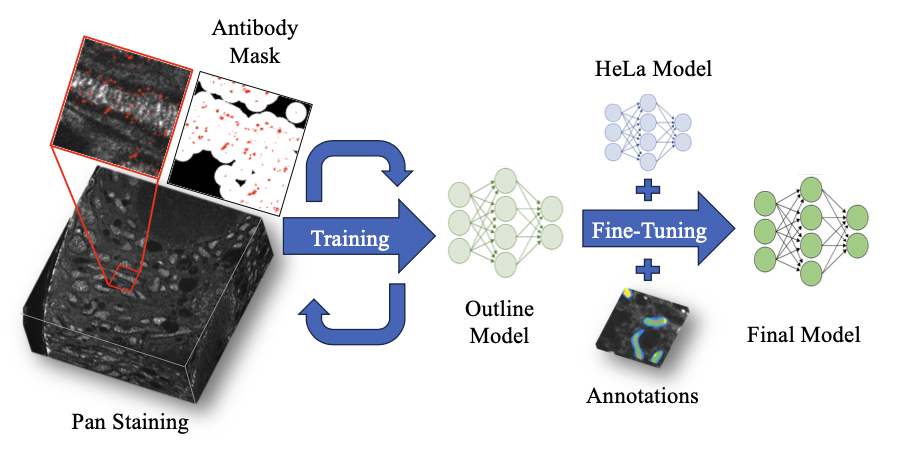

# Mitochondrial Automated Pan-ExM Segmentation
Expansion microscopy offers the exciting opportunity to combine a panstaining like NHS with target-specific dyes or antibodies. In the context of machine learning, this combination allow to reduce the requirement for large amounts of human annotations as a DL segmentation model can extract information directly from target specific staining to allow producing segmentation masks purely from the pan-staining which only need some fine-tuning with a limited amount of annotations.

In the following, we describe two approaches depending on the amount of noice contained in the target-specific staining.

# Noisy Antibodies 

If your data does not allow to derive prediction targets masks in a simple way (like via morphological operations), then this is the case to consider. This corresponds to the analysis of the kidney tissue in the paper and the workflow is illustrated in the figure above. We first train a model to predict the mitochondria outline from the antibodies before fine-tuning the model to the inner structure. The code for this workflow is contained in `NoisyImmunolabeling`

### 1. Mitochondria outline
What to do when new data arrives:
1. Test if the data is similar enough so that the old model just works. Pre-trained models are available [here](https://drive.google.com/drive/folders/1rOUEcnpw_hRCQrZbTtBN4cFgpCq5eGPT?usp=sharing).
    1. Run `NoisyImmunolabeling/prediction_finetuned.py`
    - If yes, perfect, nothing to be done.
    - If no, we have to retrain following the next steps
2. Run some experiments with `NoisyImmunolabeling/train_outline.py` with a small (~3) number of files to find the appropriate lower threshold for the immunolabelling/ antibody (AB) value. Visual inspection gives a first clue and finding the proper value can normally be achieved with less than 5 attempts. The methodolgy is described in the paper.
3. Use this model to get the mitochondria outline for the new batch (automatically created with `train_outline.py`) or for other data with `prediction_outline.py`.

If everything works out fine, you should be able to predict the outline of the target organelles (mitochondria in this example) fairly accurately:

Depending on the localisation and accuracy of your immunolabelling you might have to experiment with the AB-threshold value or the $\tau$ parameter which specifies the radius of the neighbourhood size [shown as 'Antibody Mask' in the first figure, see the paper for details].

### 2. Inner Structure
1. Run the HeLa cell model (see link for pre-trained models below) or any other available models on the kidney data but only output the matrix vs cristae decision and apply Majority Vote if an Ensemble was used. Use these predictions only for the outline predicted by the model from step 1.
2. Use `train_initial_inner.py` to train an initial model that can replicate the combination of HeLa cell prediction and the mitochondria outline. The advantage of this step is that we can basically use all available data for this step.
3. Annotate additional data
- a: If we want the overall cristae segmentation: `GenerateSegData.ipynb` was used to combine the outline of the parent directory model with the HeLa cell model. The notebook is based on `napari` and allows for fairly efficient annotation of new samples. It is especially worth annotating the data sparsely (only every ~8th slice) and ignore the other slices in the loss function. This manuelly refined is saved in `/data` and then used for the fine-tuning.
 - b: If we want to differentiate between stripped and non stripped: Use the same notebook but annotate only the difference between lamellar and non-lamellar structures.
4. Use the annotated data to fine-tune theodel with `train_fine_tune_inner.py`.

# Precise Additional Dye - MitoTracker
This case corresponds to the scenario in which an additional dye like MitoTracker allows to automatically derive segmentation masks that work as the prediction targets. 

If the prediction target can be outlined well enough by the additional dye, any segmentation framework could be used in general like the excellent [nnUNet](https://github.com/MIC-DKFZ/nnUNet). 
The work presented in our paper however only uses the MitoTracker for the general outline of the structure and then fine-tunes an additional encoder to segment the inner structure.
The code for this workflow is found in the `MitoTracker` directory.
Pretrained models can be found [here](https://drive.google.com/drive/folders/1hziGW7KhJJamqSZKYRiE0BTvMJCi43xn?usp=share_link).
These pre-trained models can be run with `/predict/make_predictions.py` and should be followed by `majorityVote.py` and `postprocess.py` to combine the ensemble predictions and apply basic post-processing.

## Nucleus
Some workflows might require the additional segmentation of the nucleus. Have a look at [this](https://github.com/AlexSauer/NucleusPanVision) repo for this.

## Install
- Adjust the cuda version in `environment.yaml` based on your GPU.
- Create a new conda environment with `conda env create -f environment.yaml`
- Install the package with `pip install -e .`

## Errors:
- If you run the scripts like `train_outline.py` from within their directories, update the `PYTHONPATH` variable like
`export PYTHONPATH='YOURPATH/src/MAPS/':$PYTHONPATH` to make sure all imports work.
- The predictions looks like noise: Make sure to have set the paths correctly when loading the model
